# ePIC Decision Box

`swf_testbed_decision_box` implements the site-specific dataset control pattern
for prompt processing:

- one full open Rucio dataset per run, containing all STF file DIDs
- one open processing dataset per site, such as `group.daq:run.123.E1_BNL`
- the prompt-processing decision box decides which site dataset(s) receive each file DID
- PanDA/JEDI consumes the site-specific datasets with `runUntilClosed=True`

The implementation is part of `swf-testbed` and uses Rucio for dataset
creation, file attachment, and dataset closure.

## Flow



In the diagram, `Data agent -> Processing agent` is the `stf_ready`
notification. The dotted arrows from the full run dataset to the BNL/JLAB
subset datasets mean the subset datasets contain the same STF file DIDs selected
from the full dataset.

## Dataset Ownership

The data agent owns the full run dataset:

```text
group.daq:swf.<run>.run
```

It creates the full dataset on `run_imminent` and attaches every STF file DID
to it on `stf_gen`.

The data agent also owns the site-specific processing datasets used by the
decision box:

```text
group.daq:run.<run>.E1_BNL
group.daq:run.<run>.E1_JLAB
```

It creates those datasets on `run_imminent`, after creating the full run
dataset. They are logical subsets of the full run dataset: the decision box
attaches the same STF file DID, not a PFN copy, to only the site dataset(s)
selected by policy. The data agent records the decision metadata in
swf-monitor for the processing agent to consume.

If `decision_box_site_dataset_template` is unset, the package default is to
derive site datasets from the full run dataset, for example
`group.daq:swf.<run>.run.E1_BNL`.

## Prompt Processing Integration

`swf-testbed/agents/data_agent.py` uses this package when
`[prompt_processing].decision_box_enabled = true`.

In that mode the data agent:

- creates the site-specific processing datasets
- applies decisions for each `stf_gen` message after attaching the STF DID to
  the full run dataset
- attaches the same STF DID to the selected site-specific datasets
- records the decision in the STF row metadata
- sends one site-specific `stf_ready` message the first time a site-specific
  dataset receives an STF DID
- closes the site-specific processing datasets on `end_run`

`swf-testbed/agents/prompt_processing_agent.py` does not mutate those input
datasets. It submits a `runUntilClosed=True` PanDA task only for the site named
in each `stf_ready` message, then uses the data-agent decision metadata to
claim and poll STF processing status. If no STF is selected for a site during a
run, no empty task is submitted for that site.

The prompt-processing workflow config enables the Rucio-backed decision box:

```toml
decision_box_enabled = true
decision_box_policy = "round-robin"
decision_box_sites = ["E1_BNL", "E1_JLAB"]
decision_box_rucio_scope = "group.daq"
decision_box_site_dataset_template = "run.{run_number}.{site_name}"
```

With this template, a full run dataset such as `group.daq:swf.102741.run`
produces site-specific processing datasets such as
`group.daq:run.102741.E1_BNL` and `group.daq:run.102741.E1_JLAB`. These logical
work-partition datasets do not match broad `group.daq:swf*` Rucio rules.

The decision box expects the same Rucio client and `rucio_comms` environment
used by the existing data agent.

When the decision box is disabled, prompt processing falls back to one PanDA
task over the full run dataset. That legacy task uses
`non_decision_box_site`, which defaults to `E1_BNL` and can be overridden by
`SWF_NON_DECISION_BOX_SITE`.

## Policy Modes

- `round-robin`: alternate assignments across the configured sites
- `hash`: deterministic assignment based on the file DID
- `both`: assign each file to all configured sites
- `none`: do not attach the file to any site-specific processing dataset
- `explicit`: use the sites supplied in the incoming message fields

Policies implement `DecisionPolicy._choose_sites(context)` and return a
`SiteAssignment`. The `DecisionContext` contains the file DID, run dataset,
run number, configured sites, sequence number, original message fields, stored
run conditions, and optional policy metadata. This keeps the placeholder
policies small while giving future experiment policies access to detector state,
run configuration, operator input, or other decision inputs without changing the
dataset mutation service.

## PanDA Submission Shape

The processing tasks consume the site datasets, not the full run dataset:

```text
--site E1_BNL  --inDS group.daq:run.101871.E1_BNL  runUntilClosed=True
--site E1_JLAB --inDS group.daq:run.101871.E1_JLAB runUntilClosed=True
```

Use split settings such as `nFilesPerJob=1` and `nChunksToWait=1` when files
should be released promptly.
